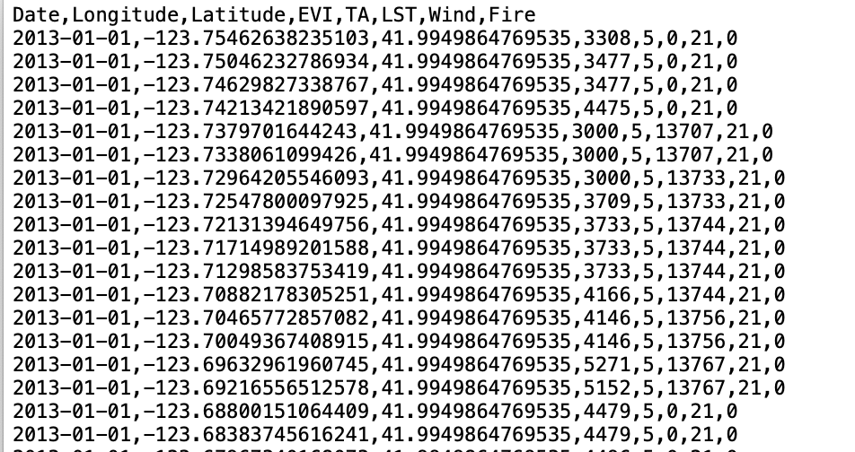
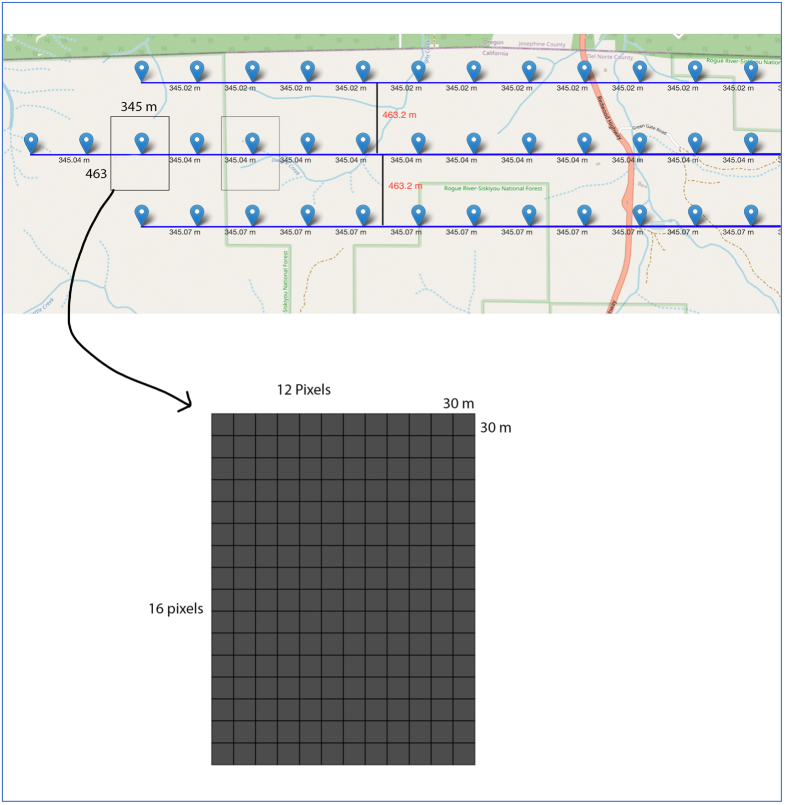
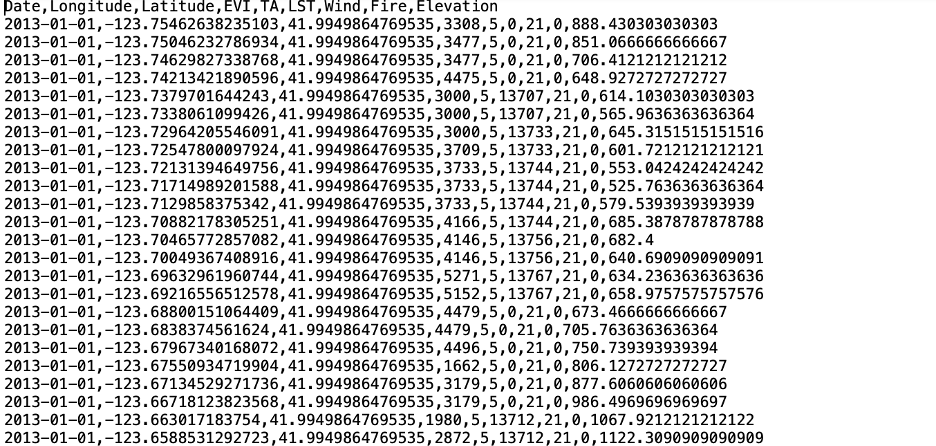

# Adding Elevation Feature

After obtaining the 2013 processed data, we focused on adding an elevation feature to our dataset. We utilized a 30-meter resolution TIF image, which provided detailed elevation data essential for our project.

A key insight came from analyzing the summer team's preprocessed data. By mapping the coordinates from their CSV file, we discovered a discrepancy in the area size they represented. Instead of the assumed 500m by 500m, the actual size was 345m by 463m. This finding was crucial as it affected how we interpreted the data.

To correct this, we wrote code that calculated the average elevation for areas based on the actual dimensions around each data point's coordinates. This ensured our elevation data was precise and aligned with real-world measurements, significantly improving the accuracy of our analysis.

The images illustrate this method, showing how the elevation for each area was calculated.

*2013 processed data*

* Each mark represents one row of processed data*

*Result (Adding elevation)*

